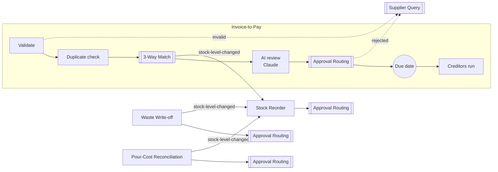

# Invoice orchestration on Camunda 8, with AI review and human oversight

A working prototype of supplier-invoice and stock control for a multi-outlet restaurant group whose purchasing all runs through a central head office.
It is built on **Camunda 8.9**, and every model, deployment, test and configuration change was made from **Claude Code through the `c8ctl` CLI**, not by clicking through the Console.

It demonstrates what I think agentic orchestration should look like in finance operations:

- **Deterministic checks where rules exist:** validation, duplicate detection, and invoice ↔ PO ↔ goods-received matching.
- **AI where judgement helps:** Claude reviews each invoice through Camunda's AI Agent connector and returns structured flags.
- **A human decision wherever money moves on uncertain ground:** any AI flag or match discrepancy removes the auto-approve option.
- **Governance as configuration:** approval limits live in admin-managed cluster variables, and who can approve what is enforced by Camunda authorizations, not by the UI.

> **Everything here is fictional.** Suppliers, prices, stock and POS sales are mock data. Approval limits and tolerances are clearly labelled **demo values**, not anyone's real policy. **No Oracle Simphony (POS) integration exists or is claimed;** the POS "export" is a mock file.

## The seven processes



| Process | What it does | Human steps |
|---|---|---|
| **Approval Routing** (shared) | DMN decides auto / manager / director from the amount, the limits and whether the item is flagged. The manager's review escalates to the director after 24h. | Manager review, Director review |
| **Invoice-to-Pay** | Validate → duplicate check → 3-way match → **Claude review** → approval → wait for due date → creditors run. Rejected or invalid invoices go to a supplier query. | Creditors run |
| **Goods Receipt 3-Way Match** | Matches invoice lines to the PO and GRN. Detects short deliveries, damage, substitutions and price variances, then broadcasts received stock. | none |
| **Supplier Query** | The creditors team resolves a disputed or invalid invoice with the supplier. | Query supplier |
| **Waste Write-off** | Staff log waste from a Tasklist start form. It is priced at cost, approved by value, then stock is adjusted. | via Approval Routing |
| **Pour-Cost Reconciliation** | POS sales × drink recipes vs the physical count. Variance over tolerance is flagged for approval; if not accepted, it goes to an investigation. | Investigate variance |
| **Stock Reorder** | Started by the `stock-level-changed` signal. Checks reorder points, drafts a requisition, approval, then a mock PO. | via Approval Routing |

Documentation: [architecture and design decisions](docs/architecture.md) · [approval routing contract](docs/approval-routing.md) · [demo walkthrough](docs/demo-walkthrough.md) · [**product friction log**](docs/friction-log.md)

## Run it on your own cluster

Prerequisites:
- Node ≥ 22.18 and `npm i -g @camunda8/cli`
- A c8ctl profile for a Camunda **8.9+** cluster, either SaaS (`c8ctl add profile demo --from-file <credentials>`) or local (`c8ctl cluster start`)
- An Anthropic API key as the connector secret **`ANTHROPIC_API_KEY`** (SaaS: Console → cluster → Connector secrets; local: `c8ctl cluster secrets set ANTHROPIC_API_KEY`)

```bash
git clone https://github.com/coder01128/camunda-invoice-orchestration && cd camunda-invoice-orchestration
C8_PROFILE=demo bash scripts/setup.sh        # deploy, set demo config, create groups + permissions
C8_PROFILE=demo node demo/seed.js            # start every scenario; work the tasks in Tasklist
C8_PROFILE=demo node tests/run-invoice-to-pay.js
```

On a local cluster, add `CREATE_LOCAL_USERS=1` to the setup command to get `demo-manager` / `demo-director` logins (password `demo`).
On SaaS, invite two users in Console and list their emails in `scripts/governance.local.env` (see the `.example` file).
The mock data is fetched from this repo over HTTPS, so the cluster's connectors need internet access.

## What's been tested

Everything below ran live on Camunda 8.9 SaaS on 24 Sep 2026:

| Suite | Result |
|---|---|
| `tests/run-approval-routing.js`: 8 cases (auto, manager, director, fail-safe, negative variance, 30s escalation, flagged, limits from cluster variable) | **8/8 pass** |
| `tests/run-invoice-to-pay.js`: 8 demo invoices through to their end state (paid, queried, duplicate, invalid, director-only), acting as each human | **8/8 pass** (AI expectations reported separately, since model output is not deterministic) |
| Signal chains: substitution → reorder; waste → reorder; stock count → reorder | verified |
| Access control: the manager login sees only manager tasks, the director only director tasks | verified in Tasklist |
| Local cluster (`c8ctl cluster start`) | **not yet verified** |

## How it was built
- Processes are generated from compact specs (`scripts/dev/specs/*.js`, using a small grid-layout generator), then linted with `c8ctl bpmn lint`.
- Connectors are configured with `c8ctl element-template apply`.
- FEEL logic was tested against the live engine (`c8ctl feel evaluate`) before it went into a diagram.
- `processes/` is Git-synced with a Web Modeler project, so the diagrams can be opened and edited there.

## Repository layout
```
processes/     deployable BPMN, DMN and forms (Git-synced with Web Modeler)
config/        DEMO approval limits and pour-cost tolerance, stored as cluster variables
mock-data/     fictional ERP, POS export and stock count, fetched by the REST connector
demo/          fictional invoices (in the pdf.js extractor's output format) and the seeder
scripts/       setup, governance, cluster-variable helper, BPMN generator
tests/         live-engine FEEL checks and end-to-end suites
docs/          architecture, contracts, walkthrough, friction log
```

## Open decisions for a real deployment
Real approval limits and categories; whether director is the right fail-safe tier when no limits are configured; escalation above director; real POS and inventory integrations (unconfirmed); approver identity taken from the logged-in user rather than a form field; production hosting and secrets management.
